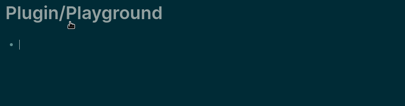

# logseq-auto-rtl-plugin


A [Logseq](https://github.com/logseq/logseq) plugin to help writing right-to-left text

This plugin will transform the bloc into a RTL bloc if RTL characters are detected at the start of the content.



For now the plugins works by adding invisible blocs in the markdown. This should be fine if you don't want to 
export the markdown. I am searching for a better solution.

## Table of Contents

- [Install](#install)
- [Maintainers](#maintainers)
- [Contributing](#contributing)
- [Sponsors](#sponsors)
- [License](#license)

## Install

For now, use the latest github release.

## Maintainers

[@abc3354](https://github.com/abc3354)

## Contributing

PRs gladly accepted !

### How to install the dev version

- build the plugin 
    ```shell
    $ nmp i
    $ npm run build
    ```
- Use Logseq's `Load unpacked plugin` to and select the directory


Small note: If editing the README, please conform to the [standard-readme](https://github.com/RichardLitt/standard-readme) specification.

## Sponsors

Huge thanks to [Motleq]() for sponsoring the development of this plugin <3

If this plugin helped you, you can buy me a coffee using the button below :)

[](https://www.buymeacoffee.com/abc3354)

## License

MIT © 2022 abc3354
